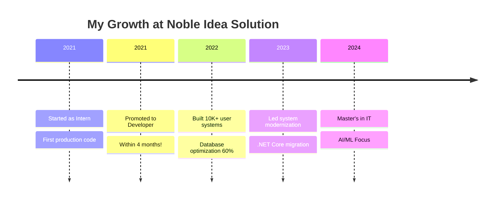

<![CDATA[<!-- Header Banner -->
<div align="center">
  
</div>

<!-- Animated Typing -->
<div align="center">
  <a href="https://git.io/typing-svg"></a>
</div>

<!-- Social Badges -->
<div align="center">
  <a href="https://www.linkedin.com/in/diwash-paudel-43b4a6157/"></a>
  <a href="https://www.diwashpaudel.com.np"></a>
  <a href="mailto:diwash302@gmail.com"></a>
  <a href="https://github.com/DiwashPaudel"></a>
</div>

<br/>

<!-- Profile Views Counter -->
<div align="center">
  
  
</div>

---

## 👋 About Me

```javascript
const diwash = {
    location: "Sydney, Australia 🇦🇺",
    education: "Master's in IT @ Australian Catholic University",
    experience: "3+ years @ Noble Idea Solution",
    
    currentFocus: ["Neural Networks", "NLP Models", "MLOps", "LLMs"],
    passions: ["Building Intelligent Systems", "Solving Complex Problems", "Open Source"],
    
    funFact: "Started with 'Hello World', now training models that learn! 🚀"
};
```

> *"I believe we're living in the most exciting era of technology. AI isn't just changing how we code — it's changing how we think about problems."*

---

## 🛠️ Tech Stack

<div align="center">

### 🤖 AI & Machine Learning


### 📊 Data Science


### 💻 Full-Stack Development


### ☁️ Cloud & DevOps


</div>

---

## 🏆 Certifications

<div align="center">
  <table>
    <tr>
      <td align="center">
        
        <br/><b>Azure AI Fundamentals</b>
        <br/><a href="https://credly.com/badges/d87ada1d-7d0a-4af9-a40e-7a43d1c6ace7">Verify</a>
      </td>
      <td align="center">
        
        <br/><b>Power Platform</b>
        <br/><a href="https://credly.com/badges/dd9ce114-f505-41a7-871b-ee413f83adf7">Verify</a>
      </td>
      <td align="center">
        
        <br/><b>Azure Data Fundamentals</b>
        <br/><a href="https://credly.com/badges/7ac22a5a-861b-45ef-b534-0ce111377b9f">Verify</a>
      </td>
      <td align="center">
        
        <br/><b>Azure Fundamentals</b>
        <br/><a href="https://credly.com/badges/660157cd-7c37-4ea1-a915-cb432bd2eb2e">Verify</a>
      </td>
    </tr>
  </table>
</div>

---

## 📈 GitHub Stats

<div align="center">
  
  
</div>

<div align="center">
  
</div>

---

## 🚀 Featured Projects

<div align="center">
  <a href="https://hungry4food.com">
    
  </a>
</div>

| Project | Description | Tech Stack |
|---------|-------------|------------|
| 🤖 **NLP Chatbot** | Intelligent customer support chatbot with 85% resolution rate | Python, NLP, Machine Learning |
| 📦 **Inventory System** | Enterprise inventory management with barcode scanning | .NET, SQL Server, Azure |
| 🌐 **Portfolio Website** | Modern portfolio with Next.js and stunning animations | Next.js, React, TypeScript |

---

## 💼 Professional Journey



---

## 📬 Let's Connect!

<div align="center">
  
💡 *I'm always excited to collaborate on AI/ML projects and innovative solutions!*

<a href="https://www.linkedin.com/in/diwash-paudel-43b4a6157/"></a>
<a href="mailto:diwash302@gmail.com"></a>
<a href="https://www.diwashpaudel.com.np"></a>

</div>

---

<!-- Activity Graph -->
<div align="center">
  
</div>

<!-- Footer -->
<div align="center">
  
</div>

<div align="center">
  <b>⭐ From <a href="https://github.com/DiwashPaudel">DiwashPaudel</a> with 💜</b>
</div>
]]>
